# Praktikum 4
# Lab 1
## Tugas 1

### > Buat program sederhana mencari bilangan terbesar dari dua buah variabel menggunakan if

Pertama kita harus memasukan inputan  seperti gambar di bawah ini, lalu tambah kan a > b: 
Lalu lakukan perintah ("print bilangan terbesar = :") 

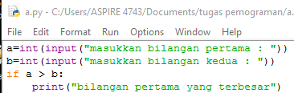

Selanjutnya tambah kan else untuk menambah kan aksi untuk menentukan mana yang lebih besar antara a dan b

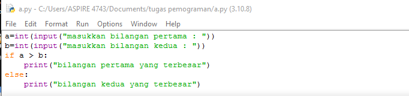

Masukan nilai yang di inginkan saya memasukan angka dan maka nilai terbesar nya adalah nah setelah di running inilah hasil nya

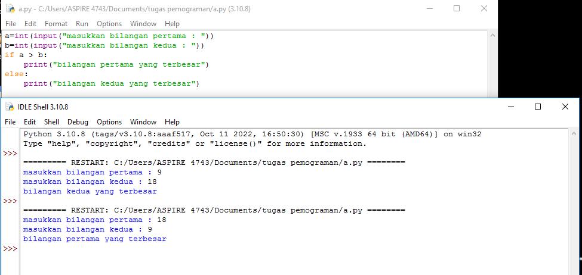

##  Tugas 2

### > Buat program mengurutkan data berdasarkan input sejumlah data dari tiga buah variabel dari data terkecil

pertama input seperti di bawah ini

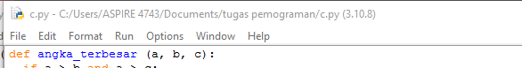

Lalu perintah dengan menggunakan metode if else seperti dibawah ini

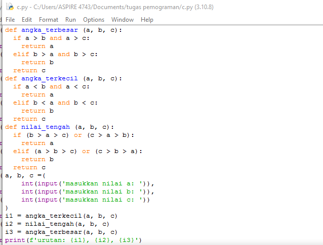

Kita mulai dengan if a < b dan if b > c lalu tambah kan else untuk penambah percabangan maka ini lah hasil pada saat di running

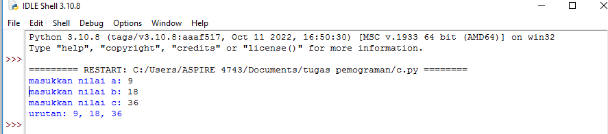

##  Tugas 3
- Buat program dengan perulangan bertingkat (nested) for yang menghasilkan output sebagai berikut:

pertama buat coding seperti :

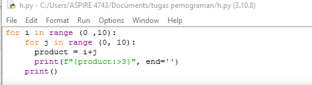

jika di running akan menjadi seperti di bawah ini
    
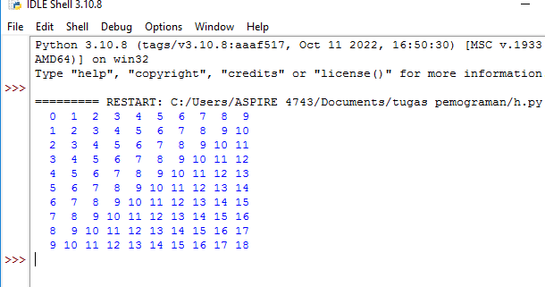

##  Tugas 4
- Tampilkan n bilangan acak yang lebih kecil dari 0.5. 
- Nilai n diisi pada saat runtime 
- Anda bisa menggunakan kombinasi while dan for untuk menyelesaikannya

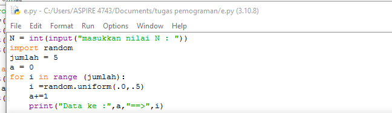

Ketika di running akan menjadi seperti ini

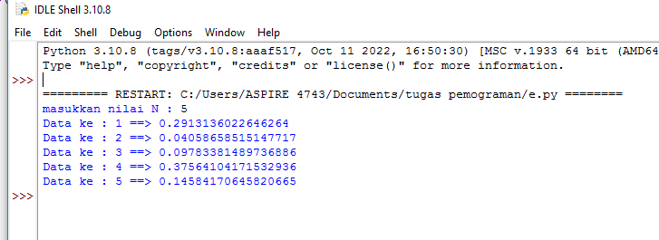

# Lab 2
# Tugas Praktikum 3
- x,y,z sebagai int
- jika x lebih besar dari z akan muncul x
- jika y lebih besar dari z maka akan muncul y
- begitu sebaliknya
seperti coding berikut:

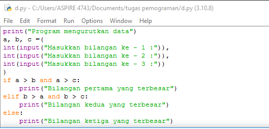

dan hasil codingan tadi sepeti:

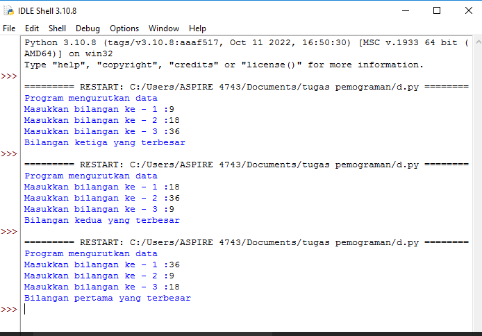

